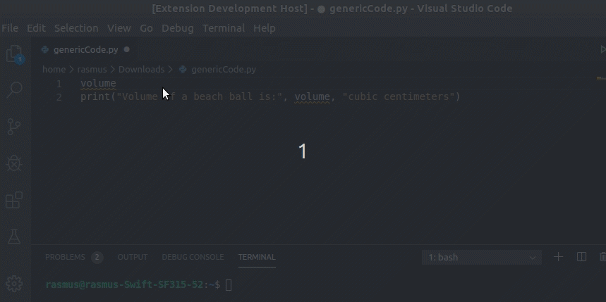

# SnippetDepot
### Real-time retrieving of snippets from our online repository

This git contains code for a proof of concept extension to VS Code that enables real-time retrieving of code snippets from an online repository. It also acts as for portal for the online snippet repository project. The project combines the principles of Google Instant Search, StackOverflow and Wikipedia into one service. The online repository can be found [here](https://snippetdepot.com/repo/). Please check out our [Wiki](https://github.com/mrconter1/SnippetDepot/wiki) were you can find information on how to add snippets and other information about this project.

*Typical use-case of SnippetDepot where a function is suggested in real-time and fetched into the project.*

## Features

* [Plugin](https://github.com/mrconter1/SnippetDepot/wiki/Plugins#existing-plugin)
  * Support for fetching Python3 snippets
  * Support for extending to other languages
* [Repository](https://snippetdepot.com/repo/)
  * Adding, searching and viewing Snippets
  * Communication with an [API](https://github.com/mrconter1/SnippetDepot/wiki/API)

# Navigation

* Official [Website](https://snippetdepot.com/)
* Submit and browse existing snippets on our [Repository](https://snippetdepot.com/repo/)
* Request features and view the roadmap on [Trello](https://trello.com/b/spUrRLGW/snippetdepot)
* Discuss the project on our [Subreddit](https://www.reddit.com/r/SnippetDepot/)
* Installation [Guide](#getting-started)
* Find more information on our [Wiki](https://github.com/mrconter1/SnippetDepot/wiki)

# Detailed Description

A lot of time during development goes into searching after small pieces of code. This can be a search after things as easy as removing the last character from a string to removing each file in a folder that has a filename starting on the letter 'a'. The usual practice of finding a solution to a problem consists of searching on Google, finding a suitable solution from StackOverflow and making it work with the code. The problem with this approach is that this procedure has to be done all over again each time a new developer encounters the problem. One of the primary goals of this project is to remove this repetition. If the community could work together in a fashion similar to StackOverflow and Wikipedia it would be possible to create reliable instant search and retrieve functionalities for different IDEs. 

This extension works together with the online snippet [repository](https://snippetdepot.com/repo/) and has two key functionalities. One is the search feature which gives suggestions of snippets which it predicts is needed and the second functionality fetches a chosen snippet. The fetched code is then put in a separate dependency file.

## Getting Started

**Installation for Windows and Linux**

1. Download the [.vsix](https://github.com/mrconter1/SnippetDepot/raw/master/snippets-0.0.1.vsix) plugin file.
2. Open Visual Studio Code and select View->Extensions from the menu to display the Extensions panel.
3. Click the `...` at the top-right corner of the Extensions panel and select "Install from VSIX..." on the menu that appears.
4. Locate the .vsix file you downloaded and click "Open".
5. Enable the Snippet functionality by pressing Ctrl+Shift+P and searching for 'Enable Snippets'.

**Note that the snippet functionality is currently only supporting Python files.*

## Release Notes

### 0.1.0

The initial release of a Snippets extension for VS Code. It contains functionality to show the proof of concept for an online snippet repository.

***

For further questions feel free to [contact](https://github.com/mrconter1/SnippetDepot/wiki/contact) us.
